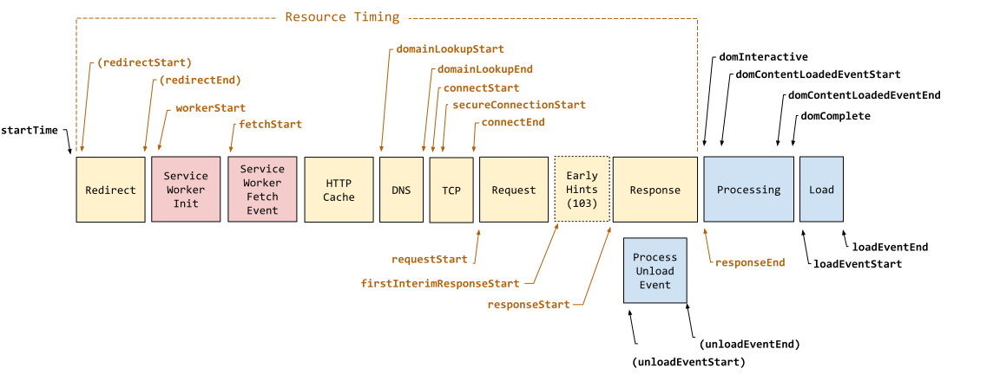
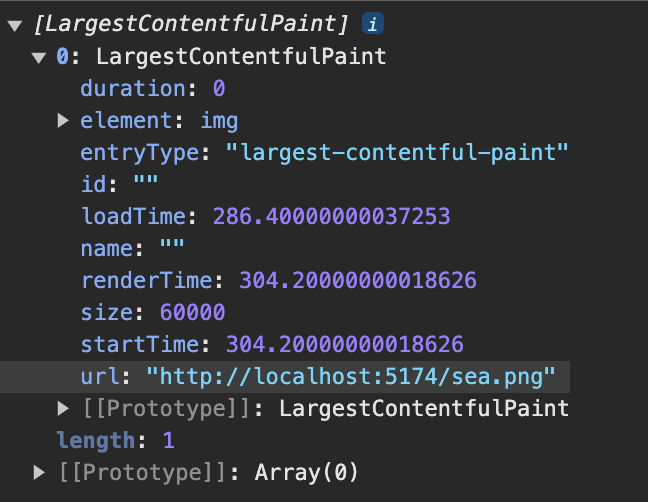
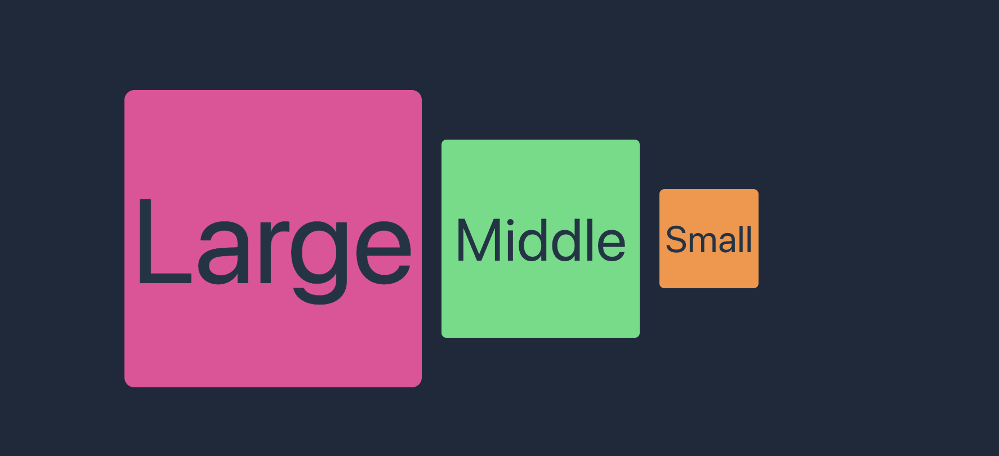
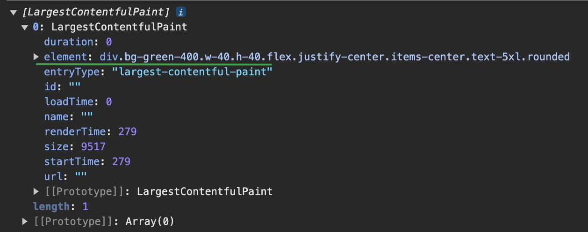
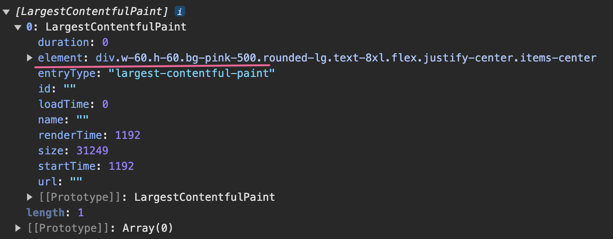

# 深入了解 Web Vitals 所有指标

先看一张图，这张图在本文非常重要。它与两个性能 API 有关。

- 导航计时 API [`Navigation Timing API`](https://developer.mozilla.org/en-US/docs/Web/API/Performance_API/Navigation_timing) 对应指标性能条目 [`PerformanceNavigationTiming`](https://developer.mozilla.org/en-US/docs/Web/API/PerformanceNavigationTiming) 的生成。

  性能条目 `PerformanceNavigationTiming` 与页面导航事件有关，页面的重载（`reload`）、跳转（`navigate`）都属于页面的导航事件，也就是说访问网页即触发页面导航事件。非常典型的一个性能指标 TTFB，它的指标条目就是 `PerformanceNavigationTiming` 类型的。

- 资源计时 API [`Resource Timing API`](https://developer.mozilla.org/en-US/docs/Web/API/Performance_API/Resource_timing) 对应指标性能条目 [`PerformanceResourceTiming`](https://developer.mozilla.org/en-US/docs/Web/API/PerformanceResourceTiming) 的生成。

  性能条目 `PerformanceResourceTiming` 与网络事件有关，比如 XHR 请求和 SVG、image、script 等资源加载。

**也就是说这张图即表示网页的导航过程，也表示资源的加载过程，不过资源加载过程是时间戳`startTime` 到 `responseEnd`，也就是 _Resource Timing_。**

由于页面导航事件更加复杂并且包含资源加载过程，因此下面以页面导航过程为例介绍几个重要时间戳。

**`startTime`：** 页面导航事件开始的时间戳。在浏览器中输入网址并按下回车，或在页面内点击链接触发跳转，都会启动页面导航，_注意纯前端路由跳转并不触发页面导航事件_。

**`responsestart`：** 页面请求开始返回时的时间戳，此时页面开始响应，标志是页面接收到第一个字节。

**`firstInterimResponsestart`：** 图中状态码 `103` 代表 `Early Hints` 「提前提示」响应，服务器在正式通过状态码 `200` 返回页面 HTML 之前，通过 `103` 可以提前告诉浏览器需要哪些资源，浏览器收到 `103` 响应之后可以提前下载这些资源。`firstInterimResponsestart` 记录的是页面请求「提前提示」响应开始时的时间戳。

> - [出于兼容性和安全原因，建议仅通过 HTTP/2 或更高版本发送 HTTP 103 Early Hints 响应](https://developer.mozilla.org/en-US/docs/Web/HTTP/Status/103#browser_compatibility)。
> - [社区关于 103 状态码浏览器支持现状的测试](https://github.com/mdn/browser-compat-data/pull/24001)。

在熟悉了页面导航和资源加载过程之后，下面开始详细的介绍各个网页性能指标。

## TTFB 首字节到达时间

[首字节到达时间（Time to First Byte）](https://web.dev/articles/ttfb?hl=en-US) 衡量的是从页面导航开始到页面响应开始（浏览器接收到第一个字节）所用的时间。

当页面请求支持 103 「提前提示」 响应，TTFB 是 `startTime` - `firstInterimResponsestart`，否则 TTFB 是 `startTime` - `responsestart`。

> 客户端渲染的 TTFB 通常比服务端渲染的 TTFB 要快。详细介绍看我之前写的 [深入了解 Next.js 中 CSR、SSR、SSG、ISR 四种前端渲染方式](https://binghuis.vercel.app/posts/dive-into-csr-ssr-ssg-isr/)。

## FCP 首次内容绘制

[首次内容绘制（First Contentful Paint）](https://web.dev/articles/fcp?hl=en-US) 衡量的是从页面导航开始到页面有任何内容渲染出来所用的时间。

> 任何内容指的是文本、图片（包括背景图）、`svg` 及 `canvas` 元素（Google 文档写的是非白色 `canvas`，但是我实际测试，白色、黑色甚至透明的 `canvas` 元素都能被 FCP 统计）。

> 服务端渲染与客户端渲染的主要区别在于，数据处理和 HTML 渲染发生的环境不同。CSR 通过 JS 在浏览器中构建页面，需要从服务器获取大量的 JS 代码，而 SSR 则在服务器上直接完成数据处理和页面渲染，返回的 HTML 已包含完整的 DOM 树。因此，SSR 省去了大量 JS chuks 的传输，通常 FCP 要比 CSR 快。
>
> 详细介绍看我之前写的 [深入了解 Next.js 中 CSR、SSR、SSG、ISR 四种前端渲染方式](https://binghuis.vercel.app/posts/dive-into-csr-ssr-ssg-isr/)。

## LCP 最大内容绘制

[最大内容绘制（Largest Contentful Paint）](https://web.dev/articles/lcp?hl=en-US) 衡量的是用户从开始导航，到页面最显著的（最大的）内容渲染出来，所用时间。

最大内容指的是页面中最显著的可见的元素，如图片、文本块或视频，其必须包含有价值的信息，以确保对用户具有实际意义。

举个例子，占位图等低熵图片通常包含大量相同或相似的像素区域，颜色单一且缺乏细节，无法提供有价值信息，因而不会被计入 LCP 统计。

> 从 2023 年 8 月之后的 Chrome 116 开始，动态图（PNG、GIF）和无封面视频也被纳入 LCP 计算，LCP 时间戳取它们第一帧呈现时间。
> 而带封面的视频，LCP 时间戳则取封面和第一帧呈现时间的较早达到者。详情查看 [官方说明](https://chromium.googlesource.com/chromium/src/+/refs/heads/main/docs/speed/metrics_changelog/2023_08_lcp.md)。

::: tip
低熵图片指的是那些在视觉上包含信息量较少的图像。

低熵图片不满足 LCP 的候选条件，但满足 FCP 的条件，因为 FCP 统计的是任何可见元素，不管它是否包含有效内容。
:::

### 最大内容的尺寸

### `Timing-Allow-Origin` 对 LCP 性能数据的影响

出于安全考虑，对于要在页面上呈现的跨域资源（比如网络图片），资源响应头 `Timing-Allow-Origin` 必须设置有效源，浏览器才能获取资源的渲染时间戳（`renderTime`），否则只能获取到资源的加载时间戳（`loadTime`），那些获取不到的时间戳将被设置为 0，所以可能会出现 LCP 比 FCP 快的诡异情况。

### LCP 性能条目的创建时机

在页面渲染过程中，新的元素不断呈现给用户，这会导致最大内容可能会不断变化，初始渲染时确定的最大内容不断被后续渲染的新内容所替代。

每次确定最大内容，浏览器都会创建一个 LCP 性能条目。LCP 性能条目是一个 `entryType` 为 `largest-contentful-paint` 的 [`LargestContentfulPaint`](https://developer.mozilla.org/en-US/docs/Web/API/LargestContentfulPaint) 对象。

只要用户开始与页面进行交互（当鼠标、键盘事件发生），LCP 监测会立即停止，不再创建新的 LCP 条目。

如果页面在后台标签中打开，只有在用户切换到该标签页时，才会创建 LCP 条目。如果在用户切换时页面已完成加载，则整个 LCP 过程都不会被监测。

> 即使从视口或 DOM 中移除最大的内容元素，只要没有呈现更大的元素，它仍然被视为最大的内容元素。这种机制在图片轮播等场景中尤为适用。

::: details 点击查看多个 LCP 条目的创建。

三个色块按照从小到大的顺序依次渲染，在这个过程中页面最大内容不断变化，因此创建了不止一个 LCP 条目。

[点击查看色块页面源代码](https://gist.github.com/binghuis/0142b10a82ff4f199ee4dc8eec9fd186)。

:::

现代浏览器的首屏加载速度就是用 LCP 衡量的，此时标志着用户已经能看到页面最重要的内容了。

## INP 下次绘制交互

[下次绘制交互（Interaction to Next Paint ）](https://web.dev/articles/inp) 衡量的是

## 总阻塞时间 Total Blocking Time

TBT 衡量的是网页的可交互性。

在 Lighthouse 10 之前，衡量这一指标用的是**可交互时间** TTI (Time to Interactive) ，它代表网页满足可靠可交互所需的时间。
可靠可交互网页需满足条件：

- 网页显示有效内容，即已完成 FCP 首次内容绘制。
- 大多数可见页面元素已注册事件处理脚本。
- 没有长任务阻塞用户交互响应。

> 执行时间超过 50ms 的任务就是长任务。

TTI 越短，代表用户能越早与页面进行交互。但是 TTI 有个很严重的问题，就是对离群网络请求和长任务非常敏感，举个例子：

离群网络请求指的是请求时间偏离正常范围的网络请求。

如果主线程空闲至少 5s 则为可靠交互页面。

网页 A 在 10s 内有三个执行 51ms 的长任务。
网页 B 在 10s 内有一个执行 9.8s 的长任务。

B 中有一个非常长的长任务，在此期间网页的渲染被阻塞，用户完全无法与页面进行交互。A 有三个较短的长任务，尽管用户会感知到页面的交互有阻塞，但是远没有 B 严重，但是 TTI 的计算方式下，A 和 B 的 TTI 指标缺差不多。TTI 明显无法有效的体现页面的可交互情况。

因此在 Lighthouse 10 TTI 作为指标已被移除了。
[TTI 的计算方式](https://web.dev/articles/tti?hl=en-US)
作为代替 TBT 计算的是长任务中超出 50ms 的时间总和，也就是页面的阻塞时间总和，如此计算，页面 A 的 TBT 是 3ms，页面 B 是 9750 毫秒。TBT 可以准确的表示页面的交互阻塞情况。

[TBT VS TTI](https://web.dev/articles/tbt?hl=en-US)

## 累计布局偏移 Cumulative Layout Shift

CLS 用于衡量视觉稳定性，表示用户遇到意外布局偏移的频率。

CLS 衡量的是页面整个生命周期内发生的所有单个布局偏移得分的总和。

[尽可能减少布局偏移指南](https://developers.google.com/publisher-tag/guides/minimize-layout-shift?hl=en-US)

[youtube CLS 的介绍](https://www.youtube.com/watch?v=zIJuY-JCjqw)

## 自定义指标
