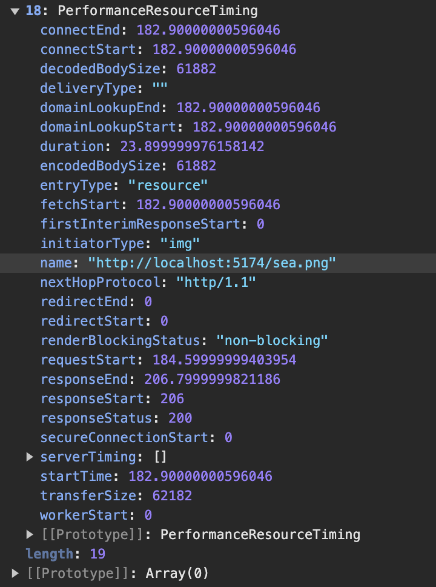
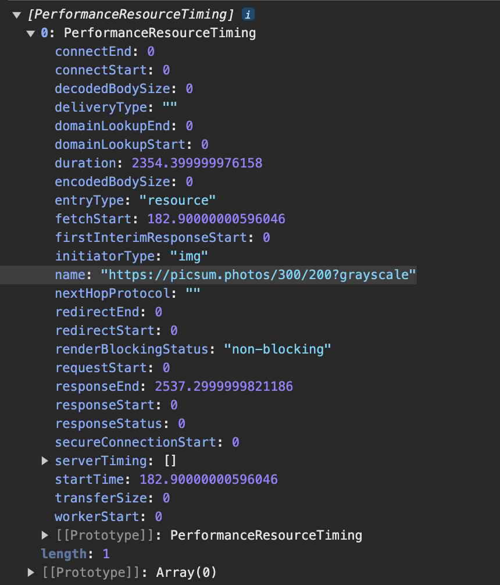

# 深入 Lighthouse 10 五大性能指标

[Lighthouse](https://github.com/GoogleChrome/lighthouse) 是谷歌开源的自动化工具，它可以对网页进行全面的审查，并提供关于性能、无障碍功能、最佳做法和 SEO 这四个维度的评分和建议，基于 Lighthouse 的审查结果，开发者们可以对网站进行针对性的优化。

下图是在 Chrome DevTools 中使用 Lighthouse 分析 Google 首页生成的报告。

> Lighthouse 不仅可以在 Chrome DevTools 中使用，还支持 Node 模块和 CI/CD 集成。
> [了解更多用法](https://developer.chrome.com/docs/lighthouse/overview)

::: details 点击查看 Google 首页的 Lighthouse 报告。

:::

通过报告可以直观的看出，Google 首页的性能指标完美，最佳做法和 SEO 良好，而无障碍方面需要改进。

指标分数对应颜色与评价：

| 颜色 | 指标（分数） |     评价 |
| :--: | ------------ | -------: |
| 绿色 | 100          |     完美 |
| 绿色 | [90, 100)    |       好 |
| 橙色 | [50, 89)     | 需要改进 |
| 红色 | [0, 49)      |       差 |

由于当前我们的关注重点是网站性能，因此其余三个维度我们不继续探究。

观察报告里面的性能部分，可以看到有五个指标，它们才是接下来的重点。

::: tip
本手册基于 Lighthouse 10，过时的性能指标除非必要，不会提及。
:::

## FCP 首次内容绘制

[First Contentful Paint](https://developer.chrome.com/docs/lighthouse/performance/first-contentful-paint?hl=zh-cn) 衡量的是用户从进页面开始，到页面有任何内容渲染出来，一共用了多长时间。

> 任何内容指的是文本、图片（包括背景图）、非白色 `canvas` 及 `svg` 元素。但排除 `iframe` 中任何内容。

FCP 包括上一个页面的卸载时间（如果是页面间跳转的话），也就是说从浏览器地址栏按下回车或在页面中点击路由跳转的那一刻，计时就已经开始了。

指标评价：

| 颜色 |   指标（秒）    | 评价   |
| ---- | :-------------: | ------ |
| 绿色 |     ≤ 1.8s      | 好     |
| 橙色 | 1.8s < FCP ≤ 3s | 待改进 |
| 红色 |      > 3s       | 差     |

## LCP 最大内容绘制

[Largest Contentful Paint](https://developer.chrome.com/docs/lighthouse/performance/lighthouse-largest-contentful-paint?hl=zh-cn) 衡量的是用户从进页面开始，到页面最大内容渲染出来，一共用了多长时间。**LCP 也是从浏览器地址栏按下回车或在页面中点击路由跳转的那一刻开始计时。**

与 FCP 不同，LCP 衡量的是网页主要内容加载完成所用的时间，而不是第一个可视元素加载完成所用的时间。

### 最大内容的定义

最大内容可以理解为页面中可见的最大图片、文本块或视频。

需要注意的是，只有包含有价值内容的元素才会被视为 LCP 的候选对象，否则不满足 LCP 的统计条件。

例如，占位图等低熵图片通常包含大量相同或相似的像素区域，它们颜色单一，缺乏细节，由于没有实际的内容价值，LCP 不会将它们计入统计。
还有覆盖整个视口的元素通常被认为是大面积背景，同样不计入 LCP。

::: tip
低熵元素指的是信息熵较低的元素。信息熵是一个衡量信息量和复杂度的概念。

低熵元素不满足 LCP（最大内容绘制）的候选条件，但满足 FCP（首次内容绘制）的条件，因为 FCP 统计的是任何可见元素，不管它是否包含有效内容。

:::

> 从 2023 年 8 月之后的 Chrome 116 开始，动态图（PNG、GIF）和无封面视频也被纳入 LCP 计算，LCP 时间戳取它们第一帧呈现时间。
> 而带封面的视频，LCP 时间戳则取封面和第一帧呈现时间的较早者。详情查看 [官方说明](https://chromium.googlesource.com/chromium/src/+/refs/heads/main/docs/speed/metrics_changelog/2023_08_lcp.md)。

对于最大内容的定义，实际上，官方规则更加严格和详细，但是这些不是我们关注的重点，对于有些知识，浅尝辄止即可。

### LCP 的上报时机

当页面渲染过程中，元素不断的呈现给用户，因此再次其间，最大内容其实很可能一直是变化的，页面渲染第一帧确定的最大内容会被后续渲染的元素不断替代，每当最大内容变化的时候就会有一个新的 PerformanceEntry 对象被创建，[PerformanceEntry](https://developer.mozilla.org/zh-CN/docs/Web/API/PerformanceEntry) 是描述单个指标性能的对象。

当用户开始与页面进行交互（键盘、鼠标事件），LCP 会立即停止监听，不会再生成新 PerformanceEntry 对象。

如果实在后台标签打开的页面，在用户聚焦新开标签页之前，LCP 条目都不会创建，如果用户聚焦新页面时页面已经完成了加载，那么整个 LCP 都不会被监听。

> 如果从视口甚至 DOM 中移除最大的内容元素，除非呈现更大的元素，否则它仍然是最大的内容元素。

这段代码可以打印出 LCP 的 PerformanceEntry 对象。

```js
const observer = new PerformanceObserver((list) => {
  console.log(list.getEntries());
});

observer.observe({ type: "largest-contentful-paint", buffered: true });
```

::: details 点击查看打印 PerformanceEntry 结果

三个色块按照从小到大的顺序依次渲染，在这个过程中页面最大内容不断变化，因此创建了不止一个 PerformanceEntry 对象。

[点击查看色块页面源代码](https://gist.github.com/binghuis/0142b10a82ff4f199ee4dc8eec9fd186)。


:::

后面的前面的大才重新创建 PerformanceEntry 对象。

### 关于跨域资源的限制与处理

PerformanceEntry 对象的 entryType 为 resource 表示这是一个资源类（XHR、svg、image、script）的指标。当存在资源跨域的情况时，只有资源返回头包含有效的 [Timing-Allow-Origin](https://developer.mozilla.org/zh-CN/docs/Web/HTTP/Headers/Timing-Allow-Origin) 来源字段，资源类型的指标时间戳才能正常计算，否则只会返回资源的 load time，其余时间戳都会被限制获取，这些被限制的时间戳会被设置为 0。当 Timing-Allow-Origin 设置了有效的源，资源类型的详细时间戳会使用高精度时间戳计算，高精度时间戳最高可到达 5 微秒级别的精度。响应头 Timing-Allow-Origin 用于指定特定站点，以允许其访问 Resource Timing API 提供的相关信息，否则这些信息会由于跨源限制将被报告为零。导致资源类型性能指标异常。

::: details 点击查看 timing-allow-origin 对 LCP 指标的影响

跨域图片没有配置 Timing-Allow-Origin 返回属性，因此只有部分属性允许被获取，除了这几个属性之外，其余都是 0。

[startTime](https://developer.mozilla.org/en-US/docs/Web/API/PerformanceEntry/startTime)
[duration](https://developer.mozilla.org/en-US/docs/Web/API/PerformanceEntry/duration)
[responseEnd](https://developer.mozilla.org/en-US/docs/Web/API/PerformanceResourceTiming/responseEnd)
[fetchStart](https://developer.mozilla.org/en-US/docs/Web/API/PerformanceResourceTiming/fetchStart)

这些属性的官方定义非常复杂，有需要的话可以去对应官方定义查看，如果不是要做极致的性能优化，一定要把所有阶段拆解出来一一分析，并不推荐查看这些所有的定义。只要只要为了获取完整的 LCP 指标数据，一定要记得资源响应要返回正确的 Timing-Allow-Origin。

详情请参考文档[Resource Timing API](https://developer.mozilla.org/zh-CN/docs/Web/API/Performance_API/Resource_timing)

| 本地图片                                  | 跨域图片                                   |
| ----------------------------------------- | ------------------------------------------ |
|  |  |

:::

通过如下代码可以获取到资源类型文件的 PerformanceEntry 对象。

```js
const observer = new PerformanceObserver((list) => {
  console.log(list.getEntries());
});
observer.observe({ type: "resource", buffered: true });
```

LCP 代表用户能看到页面最有价值的内容需要等待多长时间。

现代浏览器的首屏加载速度就是用 LCP 衡量的，因为此时用户已经可以看到页面的主要内容了。
指标评价：

| 评价   |   指标（秒）   |
| ------ | :------------: |
| 好     |     ≤ 2.5      |
| 待改进 | 2.5 < 用时 ≤ 4 |
| 差     |      > 4       |

## 总阻塞时间 Total Blocking Time

TBT 衡量的是网页的可交互性。

在 Lighthouse 10 之前，衡量这一指标用的是**可交互时间** TTI (Time to Interactive) ，它代表网页满足可靠可交互所需的时间。
可靠可交互网页需满足条件：

- 网页显示有效内容，即已完成 FCP 首次内容绘制。
- 大多数可见页面元素已注册事件处理脚本。
- 没有长任务阻塞用户交互响应。

> 执行时间超过 50ms 的任务就是长任务。

TTI 越短，代表用户能越早与页面进行交互。但是 TTI 有个很严重的问题，就是对离群网络请求和长任务非常敏感，举个例子：

离群网络请求指的是请求时间偏离正常范围的网络请求。

如果主线程空闲至少 5s 则为可靠交互页面。

网页 A 在 10s 内有三个执行 51ms 的长任务。
网页 B 在 10s 内有一个执行 9.8s 的长任务。

B 中有一个非常长的长任务，在此期间网页的渲染被阻塞，用户完全无法与页面进行交互。A 有三个较短的长任务，尽管用户会感知到页面的交互有阻塞，但是远没有 B 严重，但是 TTI 的计算方式下，A 和 B 的 TTI 指标缺差不多。TTI 明显无法有效的体现页面的可交互情况。

因此在 Lighthouse 10 TTI 作为指标已被移除了。
[TTI 的计算方式](https://web.dev/articles/tti?hl=zh-cn)
作为代替 TBT 计算的是长任务中超出 50ms 的时间总和，也就是页面的阻塞时间总和，如此计算，页面 A 的 TBT 是 3ms，页面 B 是 9750 毫秒。TBT 可以准确的表示页面的交互阻塞情况。

[TBT VS TTI](https://web.dev/articles/tbt?hl=zh-cn)

| 评价   |   指标（毫秒）   |
| ------ | :--------------: |
| 好     |      ≤ 200       |
| 待改进 | 200 < 用时 ≤ 600 |
| 差     |      > 600       |

## 累计布局偏移 Cumulative Layout Shift

CLS 用于衡量视觉稳定性，表示用户遇到意外布局偏移的频率。

CLS 衡量的是页面整个生命周期内发生的所有单个布局偏移得分的总和。

[尽可能减少布局偏移指南](https://developers.google.com/publisher-tag/guides/minimize-layout-shift?hl=zh-cn)

[youtube CLS 的介绍](https://www.youtube.com/watch?v=zIJuY-JCjqw)

| 评价   |   指标（分数）    |
| ------ | :---------------: |
| 好     |       ≤ 0.1       |
| 待改进 | 0.1 < 用时 ≤ 0.25 |
| 差     |      > 0.25       |

## 速度指数 Speed Index

| 评价   |    指标（秒）    |
| ------ | :--------------: |
| 好     |      ≤ 3.4       |
| 待改进 | 3.4 < 用时 ≤ 5.8 |
| 差     |      > 5.8       |

[网络状况报告](https://httparchive.org/)

## 自定义指标
