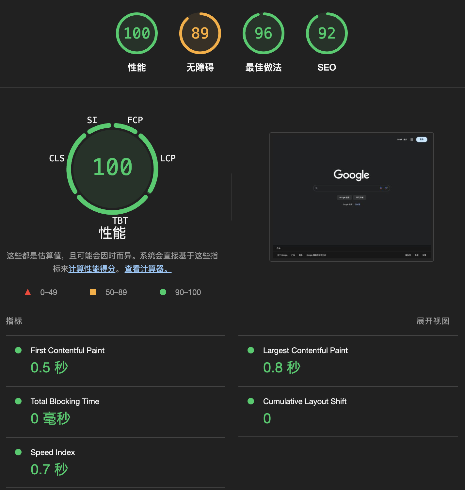

# 使用 Lighthouse 10 的五个指标评估网站性能

[Lighthouse](https://github.com/GoogleChrome/lighthouse) 是谷歌开源的自动化工具，它可以对网页进行全面的审查，并提供关于性能、无障碍功能、最佳做法和 SEO 的评分和建议。

下图是在 Chrome DevTools 中使用 Lighthouse 分析 Google 首页生成的报告。

> Lighthouse 不仅可以在 Chrome DevTools 中使用，还支持命令行工具或集成到 CI/CD 中。

根据 Lighthouse 报告可以直观的看出，Google 首页的性能指标完美，最佳做法和 SEO 良好，而无障碍方面需要改进。

分数、颜色与评价：

- [0, 49) 红色，差。
- [50, 89) 橙色，需要改进。
- [90, 100) 绿色，良好。
- 100 绿色，完美。

由于当前我们的关注重点是网站性能，因此其余三项指标我们不继续深入。

继续观察分析报告里面性能部分，可以看到有五个指标，它们才是重点。

## Lighthouse 五大性能指标

### [First Contentful Paint](https://web.dev/articles/fcp?hl=zh-cn) （FCP）首次内容绘制

FCP 是一项以用户为中心的重要指标。它衡量从用户首次导航到网页到网页内容的任何部分在屏幕上呈现的时间。

通俗说就是从刚进页面开始，到页面有任何内容渲染出来，一共用了多长时间。

> 任何内容指的是文本、图片（包括背景图）、svg 或非白色 canvas 元素。

需要注意的是这个时间包括上一个页面的卸载时间（如果是页面间跳转的话）和页面网络请求时间，也就是说从浏览器地址栏点回车的那一刻或者在页面里面点路由跳转的那一刻就已经开始算 FCP 了。

FCP 代表用户感知网页的最快时间，因为在 FCP 结束时间点用户能从页面看到东西了。

指标评价：

- 良好：小于等于 1.8 秒
- 差：大于 3 秒

### Largest Contentful Paint 最大内容绘制

### Total Blocking Time 总阻塞时间

### Cumulative Layout Shift 累计布局偏移

### Speed Index 速度指数

## [web-vitals](https://github.com/GoogleChrome/web-vitals)
