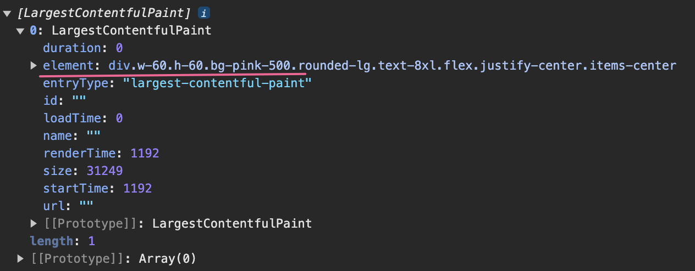

# 深入 Lighthouse 10 五大性能指标

[Lighthouse](https://github.com/GoogleChrome/lighthouse) 是谷歌开源的自动化工具，它可以对网页进行全面的审查，并提供关于性能、无障碍功能、最佳做法和 SEO 这四个维度的评分和建议，基于 Lighthouse 的审查结果，开发者们可以对网站进行针对性的优化。

下图是在 Chrome DevTools 中使用 Lighthouse 分析 Google 首页生成的报告。

> Lighthouse 不仅可以在 Chrome DevTools 中使用，还支持 Node 模块和 CI/CD 集成。
> [了解更多用法](https://developer.chrome.com/docs/lighthouse/overview)

::: details 点击查看 Google 首页的 Lighthouse 报告。

:::

通过报告可以直观的看出，Google 首页的性能指标完美，最佳做法和 SEO 良好，而无障碍方面需要改进。

指标分数对应颜色与评价：

| 颜色 | 指标（分数） |     评价 |
| :--: | ------------ | -------: |
| 绿色 | 100          |     完美 |
| 绿色 | [90, 100)    |       好 |
| 橙色 | [50, 89)     | 需要改进 |
| 红色 | [0, 49)      |       差 |

由于当前我们的关注重点是网站性能，因此其余三个维度我们不继续探究。

观察报告里面的性能部分，可以看到有五个指标，它们才是接下来的重点。

**性能指标统计不支持 `iframe`，无论是否同源。**

## FCP 首次内容绘制

[First Contentful Paint](https://developer.chrome.com/docs/lighthouse/performance/first-contentful-paint?hl=zh-cn) 衡量的是用户从进页面开始，到页面有任何内容渲染出来，一共用了多长时间。

> 任何内容指的是文本、图片（包括背景图）、`svg` 及 `canvas`（文档写的是非白色 `canvas`，但是我实际测试，白色、黑色甚至透明的 `canvas` 元素都能被 FCP 统计。）元素。

FCP 包括上一个页面的卸载时间（如果是页面间跳转的话），也就是说从浏览器地址栏按下回车或在页面中点击路由跳转的那一刻，计时就已经开始了。

指标评价：

| 颜色 |   指标（秒）    | 评价   |
| ---- | :-------------: | ------ |
| 绿色 |     ≤ 1.8s      | 好     |
| 橙色 | 1.8s < FCP ≤ 3s | 待改进 |
| 红色 |      > 3s       | 差     |

## LCP 最大内容绘制

[Largest Contentful Paint](https://developer.chrome.com/docs/lighthouse/performance/lighthouse-largest-contentful-paint?hl=zh-cn) 衡量的是用户从进页面开始，到页面最显著的内容渲染出来，一共用了多长时间。

**同 FCP 一样，LCP 也是从浏览器地址栏按下回车或在页面中点击路由跳转的那一刻开始计时。**

最大内容指的是页面中最显著的可见的元素，如图片、文本块或视频，其必须包含有价值的信息，以确保对用户具有实际意义。

举个例子，占位图等低熵图片通常包含大量相同或相似的像素区域，颜色单一且缺乏细节，无法提供有价值信息，因而不会被计入 LCP 统计。

> 从 2023 年 8 月之后的 Chrome 116 开始，动态图（PNG、GIF）和无封面视频也被纳入 LCP 计算，LCP 时间戳取它们第一帧呈现时间。
> 而带封面的视频，LCP 时间戳则取封面和第一帧呈现时间的较早达到者。详情查看 [官方说明](https://chromium.googlesource.com/chromium/src/+/refs/heads/main/docs/speed/metrics_changelog/2023_08_lcp.md)。

::: tip
低熵图片指的是那些在视觉上包含信息量较少的图像。

低熵图片不满足 LCP 的候选条件，但满足 FCP 的条件，因为 FCP 统计的是任何可见元素，不管它是否包含有效内容。
:::

对于最大内容的定义，官方规则还要更加严格和详细，但这不是我们关注的重点，对于有些知识，浅尝辄止即可。

### 最大内容的尺寸

### LCP 条目的创建时机

在页面渲染过程中，新的元素不断呈现给用户，这会导致最大内容可能会不断变化，初始渲染时确定的最大内容不断被后续渲染的新内容所替代。

每次确定最大内容，浏览器都会分派一个 `largest-contentful-paint` 条目。

只要用户开始与页面进行交互（当鼠标、键盘事件发生），LCP 监测会立即停止，不再分派新的 LCP 条目。

如果页面在后台标签中打开，只有在用户切换到该标签页时，才会创建 LCP 条目。如果在用户切换时页面已完成加载，则整个 LCP 过程都不会被监测。

> 即使从视口或 DOM 中移除最大的内容元素，只要没有呈现更大的元素，它仍然被视为最大的内容元素。这种机制在图片轮播等场景中尤为适用。

`largest-contentful-paint` 条目是一个 [PerformanceEntry](https://developer.mozilla.org/zh-CN/docs/Web/API/PerformanceEntry) 对象，即一条指标数据。

这段代码可以打印出 LCP 指标数据。

```js
const observer = new PerformanceObserver((list) => {
  console.log(list.getEntries());
});

observer.observe({ type: "largest-contentful-paint", buffered: true });
```

::: details 点击观察多个 LCP 条目的创建。

三个色块按照从小到大的顺序依次渲染，在这个过程中页面最大内容不断变化，因此创建了不止一个 LCP 条目。

[点击查看色块页面源代码](https://gist.github.com/binghuis/0142b10a82ff4f199ee4dc8eec9fd186)。



:::

### 如何处理跨域资源

浏览器使用资源计时 API [PerformanceResourceTiming](https://developer.mozilla.org/zh-CN/docs/Web/API/Performance_API/Resource_timing) 来统计 `entryType` 为 `resource` 类型的 `PerformanceEntry` 指标条目。

在资源跨域的情况下，只有当资源的响应头 `Timing-Allow-Origin` 设置了有效的源时，资源类型（如 XHR、SVG、图片、脚本）的指标数据时间戳才会正常计算。否则很多时间戳将因跨源限制被报告为零。

**资源请求一定要设置有效的 `Timing-Allow-Origin`。**

::: details 点击查看 `Timing-Allow-Origin` 对 LCP 指标时间戳的影响。

跨域图片没有配置 `Timing-Allow-Origin`，指标时间戳被限制获取，除了 [startTime](https://developer.mozilla.org/en-US/docs/Web/API/PerformanceEntry/startTime)、
[duration](https://developer.mozilla.org/en-US/docs/Web/API/PerformanceEntry/duration)、[responseEnd](https://developer.mozilla.org/en-US/docs/Web/API/PerformanceResourceTiming/responseEnd)、[fetchStart](https://developer.mozilla.org/en-US/docs/Web/API/PerformanceResourceTiming/fetchStart) 之外，其余都是 0。

| 本地图片                                  | 跨域图片                                   |
| ----------------------------------------- | ------------------------------------------ |
|  |  |

:::

通过如下代码可以获取到资源类型的指标数据。

```js
const observer = new PerformanceObserver((list) => {
  console.log(list.getEntries());
});
observer.observe({ type: "resource", buffered: true });
```

LCP 代表用户能看到页面最有价值的内容需要等待多长时间。现代浏览器的首屏加载速度就是用 LCP 衡量的，因为此时用户已经可以看到页面的主要内容了。

指标评价：

| 颜色 |   指标（秒）    | 评价   |
| ---- | :-------------: | ------ |
| 绿色 |     ≤ 2.5s      | 好     |
| 橙色 | 2.5s < LCP ≤ 4s | 待改进 |
| 红色 |      > 4s       | 差     |

## 总阻塞时间 Total Blocking Time

TBT 衡量的是网页的可交互性。

在 Lighthouse 10 之前，衡量这一指标用的是**可交互时间** TTI (Time to Interactive) ，它代表网页满足可靠可交互所需的时间。
可靠可交互网页需满足条件：

- 网页显示有效内容，即已完成 FCP 首次内容绘制。
- 大多数可见页面元素已注册事件处理脚本。
- 没有长任务阻塞用户交互响应。

> 执行时间超过 50ms 的任务就是长任务。

TTI 越短，代表用户能越早与页面进行交互。但是 TTI 有个很严重的问题，就是对离群网络请求和长任务非常敏感，举个例子：

离群网络请求指的是请求时间偏离正常范围的网络请求。

如果主线程空闲至少 5s 则为可靠交互页面。

网页 A 在 10s 内有三个执行 51ms 的长任务。
网页 B 在 10s 内有一个执行 9.8s 的长任务。

B 中有一个非常长的长任务，在此期间网页的渲染被阻塞，用户完全无法与页面进行交互。A 有三个较短的长任务，尽管用户会感知到页面的交互有阻塞，但是远没有 B 严重，但是 TTI 的计算方式下，A 和 B 的 TTI 指标缺差不多。TTI 明显无法有效的体现页面的可交互情况。

因此在 Lighthouse 10 TTI 作为指标已被移除了。
[TTI 的计算方式](https://web.dev/articles/tti?hl=zh-cn)
作为代替 TBT 计算的是长任务中超出 50ms 的时间总和，也就是页面的阻塞时间总和，如此计算，页面 A 的 TBT 是 3ms，页面 B 是 9750 毫秒。TBT 可以准确的表示页面的交互阻塞情况。

[TBT VS TTI](https://web.dev/articles/tbt?hl=zh-cn)

| 评价   |   指标（毫秒）   |
| ------ | :--------------: |
| 好     |      ≤ 200       |
| 待改进 | 200 < 用时 ≤ 600 |
| 差     |      > 600       |

## 累计布局偏移 Cumulative Layout Shift

CLS 用于衡量视觉稳定性，表示用户遇到意外布局偏移的频率。

CLS 衡量的是页面整个生命周期内发生的所有单个布局偏移得分的总和。

[尽可能减少布局偏移指南](https://developers.google.com/publisher-tag/guides/minimize-layout-shift?hl=zh-cn)

[youtube CLS 的介绍](https://www.youtube.com/watch?v=zIJuY-JCjqw)

| 评价   |   指标（分数）    |
| ------ | :---------------: |
| 好     |       ≤ 0.1       |
| 待改进 | 0.1 < 用时 ≤ 0.25 |
| 差     |      > 0.25       |

## 速度指数 Speed Index

| 评价   |    指标（秒）    |
| ------ | :--------------: |
| 好     |      ≤ 3.4       |
| 待改进 | 3.4 < 用时 ≤ 5.8 |
| 差     |      > 5.8       |

[网络状况报告](https://httparchive.org/)

## 自定义指标
