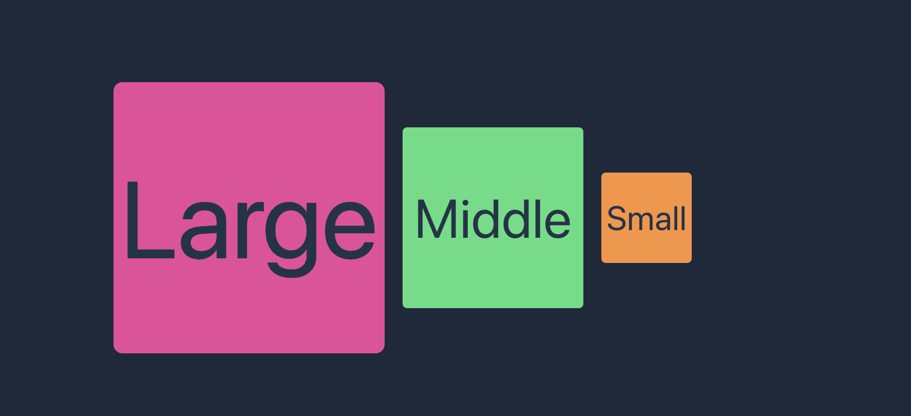
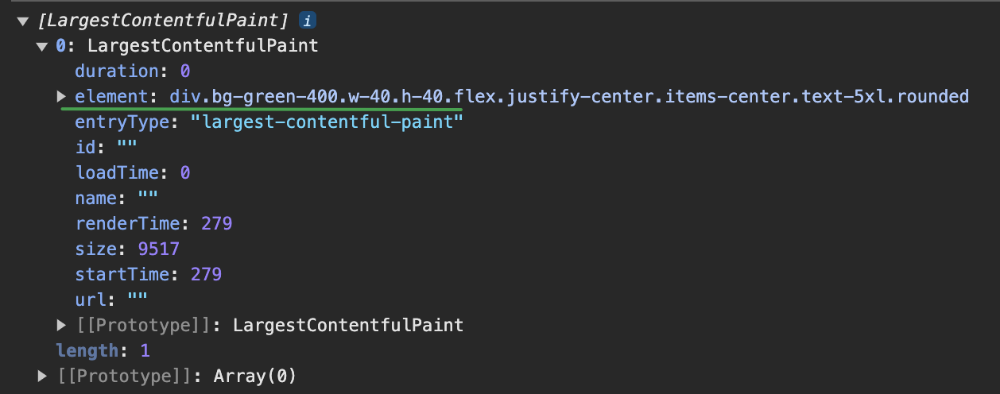

# 深入 Lighthouse 10 的五大性能指标

[Lighthouse](https://github.com/GoogleChrome/lighthouse) 是谷歌开源的自动化工具，它可以对网页进行全面的审查，并提供关于性能、无障碍功能、最佳做法和 SEO 这四个维度的评分和建议，基于 Lighthouse 的审查结果，开发者们可以针对性的对网站进行优化。

下图是在 Chrome DevTools 中使用 Lighthouse 分析 Google 首页生成的报告。

::: details 点击查看 Google 首页的 Lighthouse 报告


:::

> Lighthouse 不仅可以在 Chrome DevTools 中使用，还支持命令行工具或集成到 CI/CD 中。

根据 Lighthouse 报告可以直观的看出，Google 首页的性能指标完美，最佳做法和 SEO 良好，而无障碍方面需要改进。

指标分数对应的颜色与评价：

| 颜色 | 指标（分数） |   评价 |
| :--: | ------------ | -----: |
| 红色 | [0, 49)      |     差 |
| 橙色 | [50, 89)     | 待改进 |
| 绿色 | [90, 100)    |     好 |
| 绿色 | 100          |   完美 |

由于当前我们的关注重点是网站性能，因此其余三项指标我们不继续深入。

继续观察分析报告里面性能部分，可以看到有五个指标，它们才是重点。

### ⓵ FCP 首次内容绘制 [First Contentful Paint](https://web.dev/articles/fcp?hl=zh-cn)

FCP 衡量从用户首次导航到网页到网页任何内容在屏幕上呈现所用的时间。

通俗说就是从刚进页面开始，到页面有任何内容渲染出来，一共用了多长时间。

> 任何内容指的是文本、图片（包括背景图）、svg 或非白色 canvas 元素。

需要注意的是这个时间包括上一个页面的卸载时间（如果是页面间跳转的话）和页面网络请求时间，也就是说从浏览器地址栏点回车的那一刻或者在页面里面点路由跳转的那一刻就已经开始算 FCP 了。

指标评价：

| 评价   |   指标（秒）   |
| ------ | :------------: |
| 好     |     ≤ 1.8      |
| 待改进 | 1.8 < 用时 ≤ 3 |
| 差     |      > 3       |

### ⓶ LCP 最大内容绘制 [Largest Contentful Paint](https://web.dev/articles/lcp?hl=zh-cn)

LCP 衡量从用户首次导航到网页到网页最大内容在屏幕上呈现所用的时间。LCP 同样需要考虑上一个页面的卸载时间和页面网络请求时间。

与 FCP 不同的是，LCP 衡量的是网页主要内容加载完成所用的时间，而不是第一个可视元素加载完成所用的时间。

最大内容简单概括为可见的最大静态图片、文本块或带封面的视频。

> 从 2023 年 8 月之后的 Chrome 116 开始，动态图（PNG、GIF）和无封面视频也被纳入 LCP 计算，LCP 时间取它们第一帧呈现时间。对于带封面的视频，LCP 时间戳则取封面和第一帧呈现时间的较早者。详情查看[官方说明](https://chromium.googlesource.com/chromium/src/+/refs/heads/main/docs/speed/metrics_changelog/2023_08_lcp.md)。

对于最大内容的定义实际上官方规则更加严格和详细，但是这些不是我们关注的重点，对于有些知识，浅尝辄止即可。

覆盖整个视口的元素会被视为背景而不是内容，占位符图片或其他具有低熵的图片也不会被视为内容，它们不符合 LCP 候选条件但却符合 FCP 的候选条件。

**低熵的图片**通常指的是信息熵较低的图像。信息熵是一个衡量图像信息量和复杂度的概念。颜色单一或相似，没有复杂的纹理或图案的图片一般为低熵图片。

#### LCP 的上报时机

当页面渲染过程中，元素不断的呈现给用户，因此再次其间，最大内容其实很可能一直是变化的，页面渲染第一帧确定的最大内容会被后续渲染的元素不断替代，每当最大内容变化的时候就会有一个新的 PerformanceEntry 对象被创建，[PerformanceEntry](https://developer.mozilla.org/zh-CN/docs/Web/API/PerformanceEntry) 是描述单个指标性能的对象。

当用户开始与页面进行交互（键盘、鼠标事件），LCP 会立即停止监听，不会再生成新 PerformanceEntry 对象。

如果实在后台标签打开的页面，在用户聚焦新开标签页之前，LCP 条目都不会创建，如果用户聚焦新页面时页面已经完成了加载，那么整个 LCP 都不会被监听。

> 如果从视口甚至 DOM 中移除最大的内容元素，除非呈现更大的元素，否则它仍然是最大的内容元素。

这段代码可以打印出 LCP 的 PerformanceEntry 对象。

```js
const observer = new PerformanceObserver((list) => {
  console.log(list.getEntries());
});

observer.observe({ type: "largest-contentful-paint", buffered: true });
```

::: details 点击查看打印 PerformanceEntry 结果

三个色块按照从小到大的顺序依次渲染，在这个过程中页面最大内容不断变化，因此创建了不止一个 PerformanceEntry 对象。

[点击查看色块页面源代码](https://gist.github.com/binghuis/0142b10a82ff4f199ee4dc8eec9fd186)。





:::

LCP 代表用户能看到页面最有价值的内容需要等待多长时间。

现代浏览器的首屏加载速度就是用 LCP 衡量的，因为此时用户已经可以看到页面的主要内容了。

指标评价：

| 评价   |   指标（秒）   |
| ------ | :------------: |
| 好     |     ≤ 2.5      |
| 待改进 | 2.5 < 用时 ≤ 4 |
| 差     |      > 4       |

### ⓷ 总阻塞时间 Total Blocking Time

TBT 衡量的是网页的可交互性。

在 Lighthouse 10 之前，衡量这一指标用的是**可交互时间** TTI (Time to Interactive) ，它代表网页满足可靠可交互所需的时间。
可靠可交互网页需满足条件：

- 网页显示有效内容，即已完成 FCP 首次内容绘制。
- 大多数可见页面元素已注册事件处理脚本。
- 没有长任务阻塞用户交互响应。

> 执行时间超过 50ms 的任务就是长任务。

TTI 越短，代表用户能越早与页面进行交互。但是 TTI 有个很严重的问题，就是对长任务非常敏感，举个例子：

网页 A 在 10s 内有三个执行 51ms 的长任务。
网页 B 在 10s 内有一个执行 9.8s 的长任务。

网页 A 和 B 都受长任务影响，达到可靠可交互的时间大致相同，差不多都是 10s 左右，但是网页 B 的实际体验比 A 要差的多，因为 B 有一个超长任务阻塞，而 A 的长任务相比 B 时间短很多，在此期间 A 可以响应交互，B 则不可交互，这一点 TTI 无法体现。

因此在 Lighthouse 10 TTI 作为指标已被移除了。

### ⓸ 累计布局偏移 Cumulative Layout Shift

### ⓹ 速度指数 Speed Index

### 自定义指标
